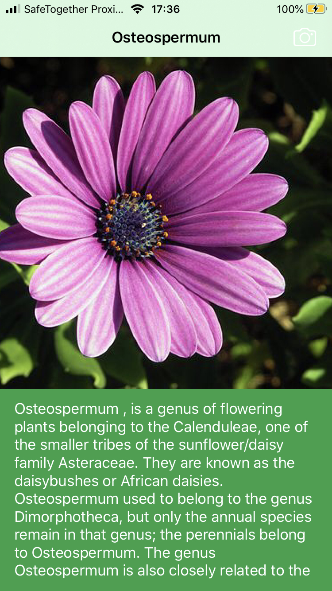

# WhatFlower_Swift

A Swift iOS application that classifies flowers on camera photo using a Caffe Machine Learning model.  Description from Wikipedia are also provided.  Frameworks CoreML, Vision and pods Alamofire, SwiftJSON and SDWebImage are used.  

Pre-trained ML model can be downloaded here: https://github.com/jimgoo/caffe-oxford102 

A Python 2.7 script is provided to convert from Caffe to Core ML model (convert-script.py). 

 
